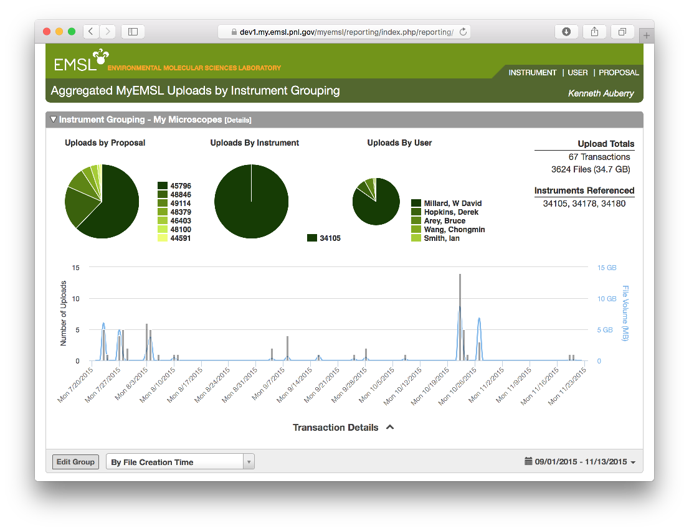

## Pacifica Reporting Module

---
### Overview
This tool provides aggregated data from the upload/ingest process, collected and
summed by instrument, user proposal, and user. Users can specify objects of interest
(instruments/users/proposals) and construct ad hoc named groups that are used for
reporting and aggregation purposes.

### Screenshots

